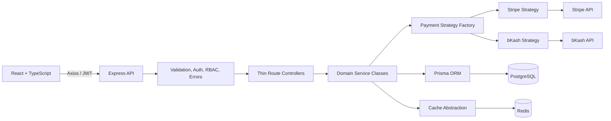

# Architecture

`UserService`, `ProductService`, `CategoryService`, `OrderService`,
`PaymentService`, `PaymentFinalizer`, and `RecommendationService` encapsulate
business behavior. Route modules validate HTTP input and delegate to services.
Provider-specific logic is behind `PaymentStrategy`.

Category trees use cache-aside Redis reads with key `categories:tree:v1` and a
configurable TTL. Mutations invalidate the key. A one-second failed connection
falls back to PostgreSQL and logs a warning.

Order creation captures current prices and calculates values inside one database
transaction. Payment finalization uses a serializable transaction. It
conditionally claims a pending order, atomically decrements products with
`stock >= quantity`, records success, and commits the paid status together.
