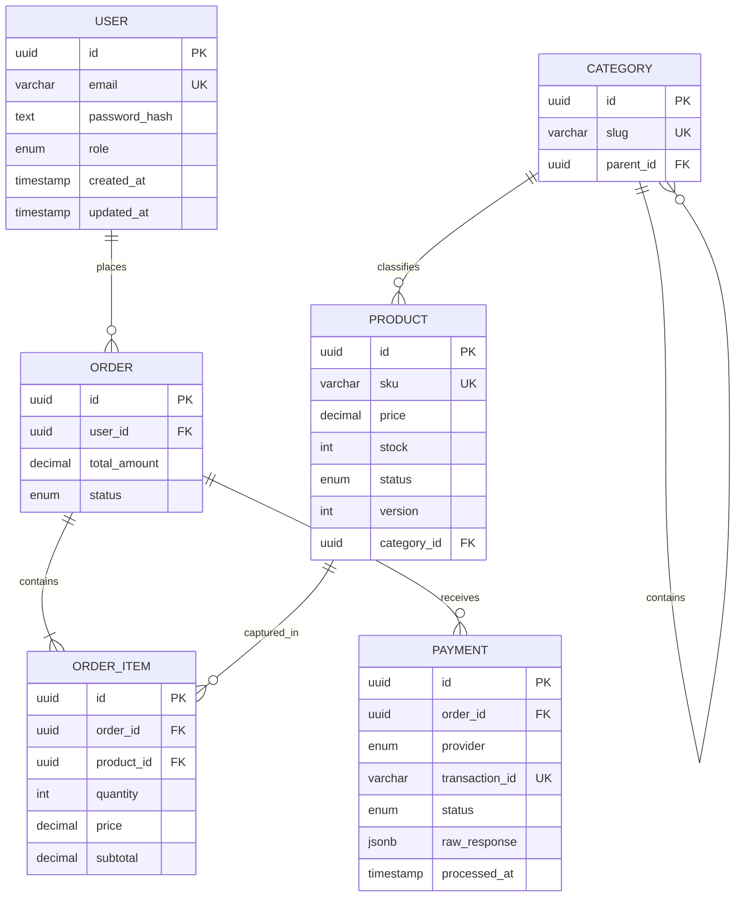

# Entity Relationship Diagram

The migration adds indexes for every assessment query path: user email, category
parent, product SKU/status/category/name, order user/status/date, order-item
order/product, and payment order/provider/status/transaction.
