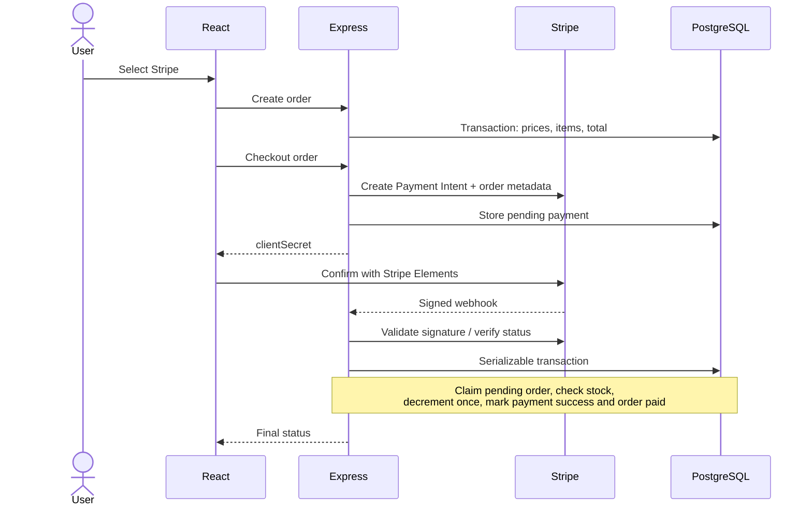
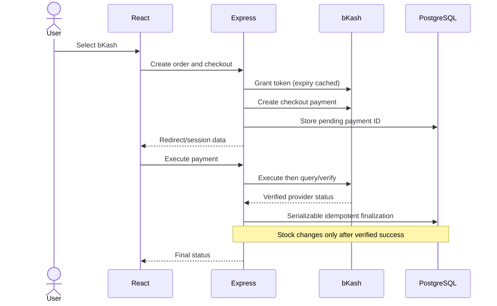

# Payment Flows

## Stripe

```mermaid
sequenceDiagram
  actor U as User
  participant F as React
  participant A as Express
  participant S as Stripe
  participant D as PostgreSQL
  U->>F: Select Stripe
  F->>A: Create order
  A->>D: Transaction: prices, items, total
  F->>A: Checkout order
  A->>S: Create Payment Intent + order metadata
  A->>D: Store pending payment
  A-->>F: clientSecret
  F->>S: Confirm with Stripe Elements
  S-->>A: Signed webhook
  A->>S: Validate signature / verify status
  A->>D: Serializable transaction
  Note over A,D: Claim pending order, check stock,<br/>decrement once, mark payment success and order paid
  A-->>F: Final status
```

## bKash

```mermaid
sequenceDiagram
  actor U as User
  participant F as React
  participant A as Express
  participant B as bKash
  participant D as PostgreSQL
  U->>F: Select bKash
  F->>A: Create order and checkout
  A->>B: Grant token (expiry cached)
  A->>B: Create checkout payment
  A->>D: Store pending payment ID
  A-->>F: Redirect/session data
  F->>A: Execute payment
  A->>B: Execute then query/verify
  B-->>A: Verified provider status
  A->>D: Serializable idempotent finalization
  Note over A,D: Stock changes only after verified success
  A-->>F: Final status
```

Repeated verification and webhook deliveries observe a successful payment or a
non-pending order and return without another stock decrement.
